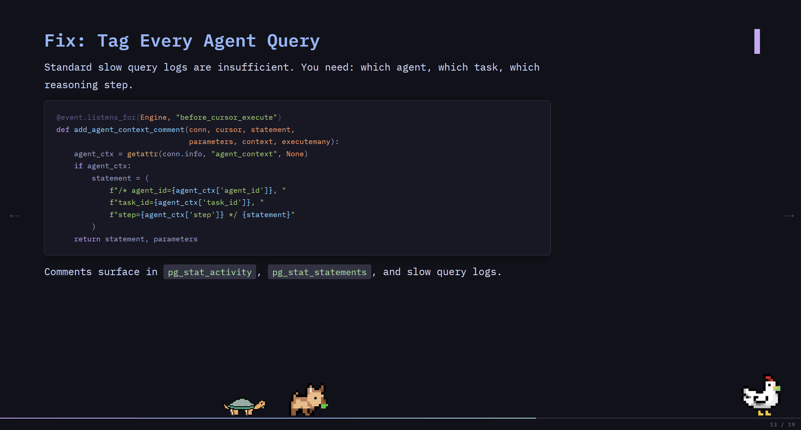

# present-md

Write slides in Markdown, run locally, present clean - built for engineers who hate slide tools.



## Usage

```bash
npx present-md slides.md            # serve on :7890, auto-open browser
npx present-md slides.md -p 3000    # custom port
npx present-md slides.md --no-open  # serve only, print URL
npx present-md slides.md --pdf      # export to PDF
```

## Writing slides

Each slide is a block of Markdown separated by `---` on its own line:

```markdown
# First slide

Some content here.

---

## Second slide

More content.

---

# Thank you
```

The first `#` heading in the file is used as the browser tab title.

### Text and formatting

Standard Markdown works everywhere — headings, bold, italic, inline code, blockquotes, tables, and lists:

```markdown
## My slide

> "Good programmers write code that humans can understand." — *Martin Fowler*

- Point one with **bold** and `inline code`
- Point two with *italic*

| Column A | Column B |
|----------|----------|
| foo      | bar      |
```

### Code blocks

Fenced code blocks get full syntax highlighting:

````markdown
```typescript
function parseSlides(markdown: string): Slide[] {
  return markdown
    .split(/\n---\n/)
    .filter(Boolean)
    .map(raw => processSlide(raw));
}
```
````

### Image placement

Images are positioned using the title attribute (the quoted string after the URL):

```markdown
              # image on right half, content on left
               # image on left half, content on right
                 # fullscreen background behind content
  # combine position with opacity (0.0–1.0)
                      # inline, default flow
```

| Directive    | Effect                        |
| ------------ | ----------------------------- |
| `right`      | Image fills the right half    |
| `left`       | Image fills the left half     |
| `bg`         | Fullscreen background         |
| `opacity:N`  | Transparency, 0.0 – 1.0       |

`bg` works well for title slides and section dividers — the text sits on top with full readability.

## Keyboard shortcuts

| Key             | Action              |
| --------------- | ------------------- |
| `→` / `Space`   | Next slide          |
| `←`             | Previous slide      |
| `O`             | Overview grid       |
| `F`             | Toggle fullscreen   |
| `Home` / `End`  | First / last slide  |

## Features

- Catppuccin Mocha dark theme — always, no override possible
- IBM Plex Mono throughout (headings, body, code)
- Highlight.js (tokyo-night-dark theme) for code blocks via CDN
- Full Markdown: tables, blockquotes, lists, bold/italic, inline code, HR
- Smooth slide transitions with directional animation
- Progress bar + slide counter HUD
- HTTP server (not `file://`) so local images load without CORS issues
- Touch swipe support
- PDF export via `--pdf`

## Examples

See `examples/` for sample slide decks:

- `examples/example-1.md` — feature walkthrough
- `examples/example-2.md` — real-world talk: databases and agentic AI
